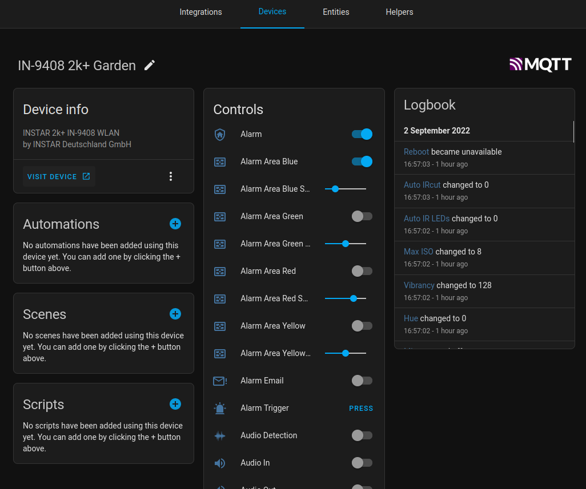
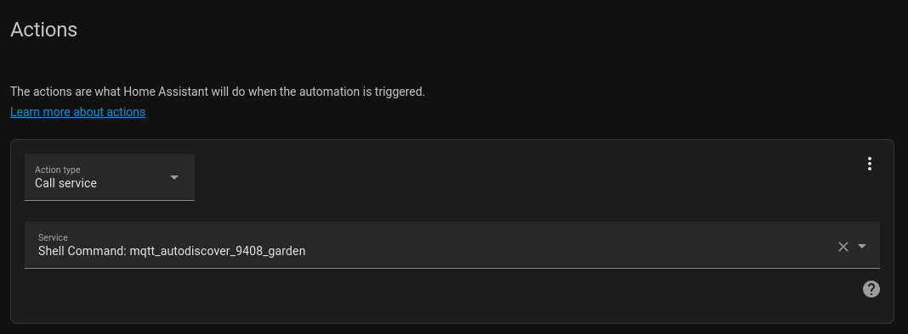

# Home Assistant :: MQTT Discovery 

The [discovery of MQTT devices](https://www.home-assistant.io/docs/mqtt/discovery/) will enable one to use MQTT devices with only minimal configuration effort on the side of Home Assistant. The configuration is done on the device itself and the topic used by the device. Similar to the HTTP binary sensor and the HTTP sensor. To prevent multiple identical entries if a device reconnects, a unique identifier is necessary. Two parts are required on the device side: The configuration topic which contains the necessary device type and unique identifier, and the remaining device configuration without the device type.


1. Start by defining entities for your device, e.g. [INSTAR IN-9408 2k+ WQHD IP Camera](https://mpolinowski.github.io/docs/IoT-and-Machine-Learning/Home_Automation/2022-07-10-home-assistant-mqtt-autodiscovery-part-i/2022-07-10).
2. Prepare the data to be used by the [mqtt5-client script](https://github.com/mpolinowski/ha-mqtt-python/blob/master/mqtt5_client.py) by adding all topics and payloads to an [JSON array](https://github.com/mpolinowski/ha-mqtt-python/blob/master/config_topics.json).
3. Add your MQTT broker credentials to the [configuration file](https://github.com/mpolinowski/ha-mqtt-python/blob/master/config.py).
4. You can test run the script `python mqtt5_client.py`.
5. [Add an automation to Home Assistant](https://mpolinowski.github.io/docs/IoT-and-Machine-Learning/Home_Automation/2022-07-11-home-assistant-mqtt-autodiscovery-part-ii/2022-07-11) that runs the [Python script](https://mpolinowski.github.io/docs/IoT-and-Machine-Learning/Home_Automation/2022-07-12-home-assistant-mqtt-python/2022-07-12) through the __Shell Extension__ whenever your camera connects to your broker - making sure that your camera "entities" remain available in Home Assistant.





> __UPDATE__: Added `Option Parse` to the client script to allow you to define the configuration file you want to use when you call the script. Point the client to the JSON file you want to use with an `-f` flag. This way it is now possible to add several configuration files for all your MQTT devices and use the same Python MQTT client to register those your devices when they connect.


## Adding the Script as a Service

1. Upload this repository into a folder `python_scripts` inside HA's config directory.
2. Create another folder next to it called `shell`.
3. Add the following shell script that points the Python binary inside the HA docker container to your Python script:

```bash
mkdir config/shell
nano config/shell/mqtt_autodiscover_9408_garden.sh
```

__mqtt_autodiscover_9408_garden.sh__


```bash
#!/bin/bash
python /config/python_scripts/mqtt5_client.py -f /config/python_scripts/test.json
```


4. To activate the __Shell Extension__ and expose our script to HA we need to add the following lines to the HA `configuration.yaml`:


```yml
# Auto configure 9408 with mqtt
shell_command:
  mqtt_autodiscover_9408_garden: /bin/ash /config/shell//mqtt_autodiscover_9408_garden.sh
```


5. Restart HA - select __Call service__ as your __Automation__ __Action__ and you should find your shell script listed as a service:


